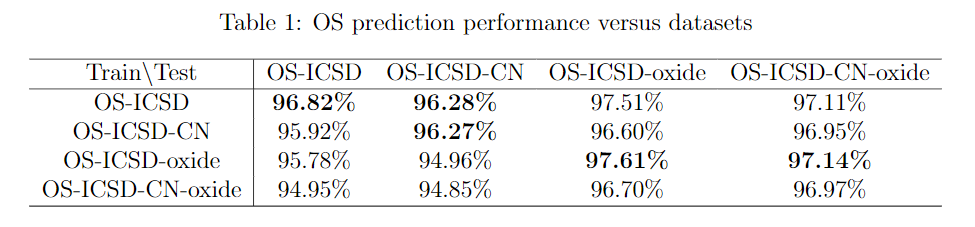

# BERTOS
BERTOS: transformer language model for oxidation state prediction

Nihang Fu, <b>Jeffrey Hu</b>, Ying Feng, Jianjun Hu* <br>

Machine Learning and Evolution Laboratory <br>
Department of Computer Science and Engineering <br>
University of South Carolina

University of Illinois Urbana-Champaign <br>
Department of Material Science and Engineering <br>

### Cite our paper:
Fu, N., Hu, Jeffrey., Feng, Y., Morrison, G., Loye, H.C.Z. and Hu, J., 2023.
Composition based oxidation state prediction of materials using deep learn-
ing language models. Advanced Science, 10(28), p.2301011. (IF:14.2) [PDF](https://advanced.onlinelibrary.wiley.com/doi/am-pdf/10.1002/advs.202301011)

Abstract: Oxidation states (OS) are the charges on atoms due to electrons gained or
lost upon applying an ionic approximation to their bonds. As a fundamental
property, OS has been widely used in charge-neutrality verification, crystal
structure determination, and reaction estimation. Currently, only heuristic
rules exist for guessing the oxidation states of a given compound with many
exceptions. Recent work has developed machine learning models based on
heuristic structural features for predicting the oxidation states of metal ions.
However, composition-based oxidation state prediction still remains elusive
so far, which has significant implications for the discovery of new materials
for which the structures have not been determined. This work proposes a
novel deep learning-based BERT transformer language model BERTOS for
predicting the oxidation states for all elements of inorganic compounds given
only their chemical composition. This model achieves 96.82% accuracy for
all-element oxidation states prediction benchmarked on the cleaned ICSD
dataset and achieves 97.61% accuracy for oxide materials. It is also
demonstrated how it can be used to conduct large-scale screening of
hypothetical material compositions for materials discovery.

## Table of Contents
- [Installations](#Installations)

- [Datasets](#Datasets)

- [Usage](#Usage)

- [Pretrained Models](#Pretrained-models)

- [Performance](#Performance)

- [Acknowledgement](#Acknowledgement)

## Installations

0. Set up virtual environment
```
conda create -n bertos
conda activate bertos
```

1. PyTorch and transformers for computers with Nvidia GPU.
```
conda install pytorch==1.8.0 torchvision==0.9.0 torchaudio==0.8.0 cudatoolkit=11.1 -c pytorch -c conda-forge
conda install -c conda-forge transformers
```
If you only has CPU on your computer, try this:
```
pip install transformers[torch]
```
If you are using Mac M1 chip computer, following [this tutorial](https://jamescalam.medium.com/hugging-face-and-sentence-transformers-on-m1-macs-4b12e40c21ce) or [this one](https://towardsdatascience.com/hugging-face-transformers-on-apple-m1-26f0705874d7) to install pytorch and transformers.

2. Other packagess
```
pip install -r requirements.txt
```  

## Datasets  
Our training process is carried out on our BERTOS datasets. After extracting the data under `datasets` folder, you will get the following four folders `ICSD`, `ICSD_CN`, `ICSD_CN_oxide`, and `ICSD_oxide`.

## Usage
### A Quick Run
Quickly run the script to train a BERTOS using the OS-ICSD-CN training set and save the model into the `./model_icsdcn` folder.
```
bash train_BERTOS.sh
```  
### Training
The command to to train a BERTOS model.  
```
python train_BERTOS.py  --config_name $CONFIG_NAME$  --dataset_name $DATASET_LOADER$   --max_length $MAX_LENGTH$  --per_device_train_batch_size $BATCH_ SIZE$  --learning_rate $LEARNING_RATE$  --num_train_epochs $EPOCHS$    --output_dir $MODEL_OUTPUT_DIRECTORY$
```
We use `ICSD_CN` dataset as an example:
```
python train_BERTOS.py  --config_name ./random_config   --dataset_name materials_icsd_cn.py   --max_length 100  --per_device_train_batch_size 256  --learning_rate 1e-3  --num_train_epochs 500    --output_dir ./model_icsdcn
```
 If you want to change the dataset, you can use different dataset file to replace `$DATASET_LOADER$`, like `materials_icsd.py`, `materials_icsdcn.py`, `materials_icsdcno.py`, and `materials_icsdo.py`. And you can also follow the intructions of [huggingface]() to build you own custom dataset.

### Predict
Run `getOS.py` file to get predicted oxidation states for a input formula or input formulas.csv file containing multiple formulas. <br>
Using your model:
```
python getOS.py --i SrTiO3 --model_name_or_path ./model_icsdcn
python getOS.py --f formulas.csv --model_name_or_path ./model_icsdcn

```
Using pretrained model:
```
python getOS.py --i SrTiO3 --model_name_or_path ./trained_models/ICSD_CN
python getOS.py --f formulas.csv --model_name_or_path ./trained_models/ICSD_CN
```

## Pretrained Models
Our trained models can be downloaded from figshare [BERTOS models](https://figshare.com/articles/online_resource/BERTOS_model/21554823), and you can use it as a test or prediction model.


## Performance


Removing `OS`, the datasets under `datasets` folder correspond to the datasets in the figure.

## Acknowledgement
We use the transformer model as implmented in Huggingface.
```
@article{wolf2019huggingface,  
  title={Huggingface's transformers: State-of-the-art natural language processing},  
  author={Wolf, Thomas and Debut, Lysandre and Sanh, Victor and Chaumond, Julien and Delangue, Clement and Moi, Anthony and Cistac, Pierric and Rault, Tim and Louf, R{\'e}mi and Funtowicz, Morgan and others},  
  journal={arXiv preprint arXiv:1910.03771},  
  year={2019}  
}
```

## Cite our work
```
Nihang Fu,†,§ Jeffrey Hu,†,§ Ying Feng,‡ Hanno zur Loye,¶ and Jianjun Hu, Composition based oxidation state prediction of
materials using deep learning. 2022.

```

# Contact
If you have any problem using BERTOS, feel free to contact via [funihang@gmail.com](mailto:funihang@gmail.com).
